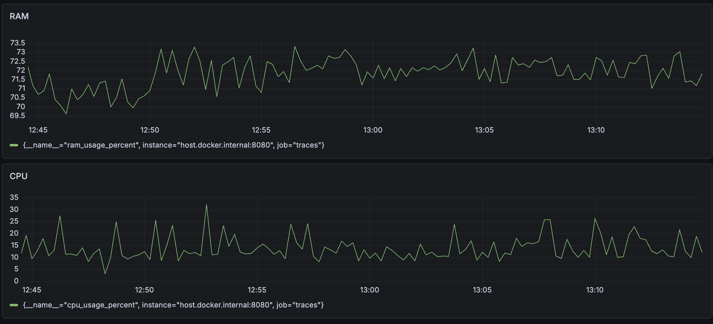

# traces



## Description

System monitor that collects CPU and RAM usage and displays the metrics through Prometheus and Grafana.

## How to run

*Note: to run this project you need to have [Docker](https://www.docker.com/) and [Go](https://go.dev/) installed.*

Clone this repository:

```bash
git clone https://github.com/s-gas/traces.git
```

Change to the project directory:

```bash
cd traces
```

Run the app and the containers through the Makefile:

```bash
make run
```

To stop the app press `Ctrl-C`.

To stop the containers:

```bash
docker compose down
```
