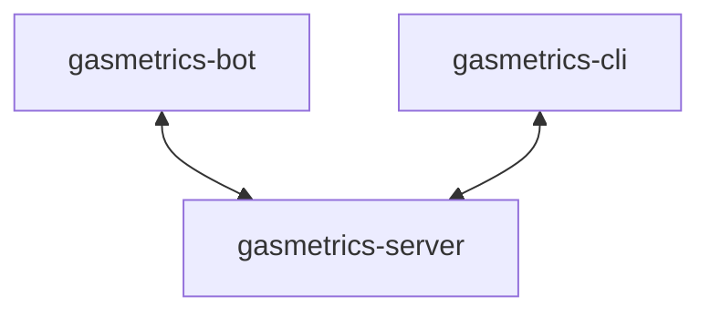

# gasmetrics


Home gas consumption tracker.

Gas readings can be submitted via Telegram or via CLI and are stored in a PostgreSQL database, which is queried through a REST API.

## Table of contents
- [Infrastructure](#infrastructure)
- [API Endpoints](#api-endpoints)
- [How to create a Telegram bot](#how-to-create-a-telegram-bot)
- [How to run the containers](#how-to-run-the-containers)
- [How to install the CLI tool](#how-to-install-the-cli-tool)
- [How to use the CLI tool](#how-to-use-the-cli-tool)
- [How to submit a readings through Telegram](#how-to-submit-a-reading-through-telegram)
- [Troubleshooting](#troubleshooting)

## Infrastructure

The project is built as three independent services, which communicate via HTTP.

Each service has a single responsibility:
- gasmetrics-server: business logic and database access
- gasmetrics-bot: input channel (Telegram)
- gasmetrics-cli: input/output channel



## API Endpoints

>`gasmetrics-server` listens on port `1024` in the Docker container and does **not** expose any port on the host machine.

### Get readings

```
GET /
```

Returns a list of gas readings in m³.

This endpoint accepts a `limit` query parameter for specifying how many entries to return:

```
GET /?limit={n}
```

If not specified, it returns 10 entries.

**Response body:**

```json
[
  {
    "id": 12,
    "value": 678,
    "recorded_at": "2026-05-30T12:08:48.197787+02:00"
  },
  {
    "id": 5,
    "value": 673,
    "recorded_at": "2026-05-22T13:48:34.590414+02:00"
  },
  {
    "id": 4,
    "value": 672,
    "recorded_at": "2026-05-20T09:24:54.176378+02:00"
  }
]
```

### Get average consumption

```
GET /stats
```

Returns the average consumption per day in m³.

**Response body:**

```json
{
  "avg": 1.472222222222222
}
```

### Submit gas reading

```
POST /
```

Submits a new gas reading in m³.

**Request body:**

```json
{
  "value": 678
}
```

### Delete reading

```
DELETE /{id}
```

It deletes the gas reading with the specified `id`.

## How to create a Telegram bot

In order to create a new bot:
1. Start a chat with `@BotFather`
2. Send `/newbot`
3. Choose a name and a username
4. Store the token

## How to run the containers

>In order to run this project, a container running PostgreSQL is needed. You can find my configuration in my [hauslab](https://github.com/s-gas/hauslab) repo.

Clone this repository:

```bash
git clone https://github.com/s-gas/gasmetrics.git
```

Change to the directory:

```bash
cd gasmetrics
```

Create the files to store the Telegram token and the PostgreSQL password:

```bash
mkdir secrets
printf '<token>' > gasmetrics-bot/secrets/telegram_token.txt
printf '<password>' > gasmetrics-server/secrets/postgres_password.txt
```

Run the containers:

```bash
docker compose up
```

This will start the two containers:
- gasmetrics-server
- gasmetrics-bot

## How to install the CLI tool

>In order to use the CLI tool, a container running a reverse proxy is needed. It needs to be configured with `gasmetrics.hauslab` as virtual host. You can find my configuration in my [hauslab](https://github.com/s-gas/hauslab) repo.

From the `gasmetrics-cli` directory, run:

```bash
go install 
```

This command will install the binary in `~/go/bin`.

## How to use the CLI tool

```bash
gasmetrics-cli <command> [flags]
```
### Commands

| Command | Arguments | Description                         |
|---------|-----------|-------------------------------------|
| add     | <value>   | Submit a new gas reading in m³      |
| list    |           | List the last 10 readings           |
| average |           | Get the average consumption per day |
| delete  | <id>      | Delete a reading by ID              |

### Flags for list command

| Flag      | Short | Default | Description                |
|-----------|-------|---------|----------------------------|
| `--limit` | `-l`  | `10`    | Number of readings to list |

## How to submit a reading through Telegram

Send a message to the Telegram bot with the reading in m³.

If the reading is valid, the bot will reply with:

```
Entry added successfully
```

Otherwise it will reply with the HTTP status code:

```
Failed to add entry: status code: <status code>
```

## Troubleshooting

### Docker containers

Make sure that the containers are running, you can verify by running:

```bash
docker ps
```

You should have at least 3 containers running:
- `gasmetrics-server`
- `gasmetrics-bot`
- container running PostgreSQL

### PostgreSQL password

Make sure that the password for connecting to PostgreSQL is the same as the one used for the container running PostgreSQL.

### Telegram token

To retrieve the token:
1. Send `/mybots` to `@BotFather`
2. Choose the bot from the list
3. Go into `API Token`
