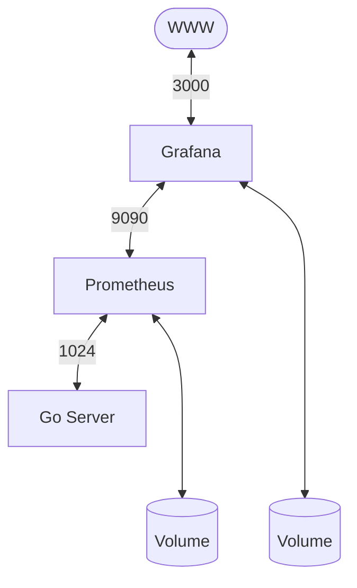

# sysmetrics


## Description

System monitor that collects CPU and RAM usage and displays the metrics through Prometheus and Grafana.

### Diagram of the infrastructure:



### Services

- **Go Server**  
  Runs in a Docker container and exposes the data at `/metrics`.
  In order to read the metrics of the host machine, the host`/proc` directory is mounted into the container, overwriting its `/proc` directory.

- **Prometheus**  
  Runs in a Docker container and scrapes the endpoint every 10 seconds and stores the data.

- **Grafana**  
  Runs in a Docker container and displays the data in a dashboard, which is accessible at `http://localhost:3000`. The admin password necessary to access the dashboard is stored as a Docker secret in `secret/grafana_password.txt`.

### Volumes

Two persistent volumes store Prometheus and Grafana data.

## How to run

*Note: to run this service you need to have [Docker](https://www.docker.com/) and [Go](https://go.dev/) installed.*

Clone the hauslab repo:

```bash
git clone https://github.com/s-gas/hauslab.git
```

Change to the service directory:

```bash
cd hauslab/sysmetrics
```

Create the file to store the admin password necessary to access the dashboard:

```bash
mkdir secrets
printf '<password>' > secrets/grafana_password.txt
```

Run the containers:

```bash
docker compose up
```

To view the dashboard, navigate to `http://localhost:3000` and login as admin using the password stored in `secrets/grafana_password.txt`

To stop the containers:

```bash
docker compose down
```

To wipe the data in the named volumes:

```bash
docker compose down -v
```
